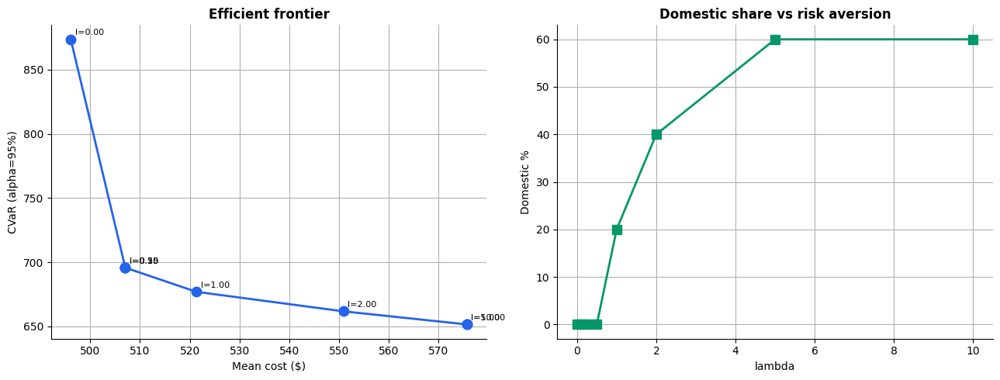
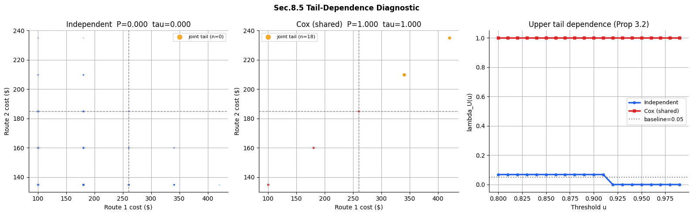
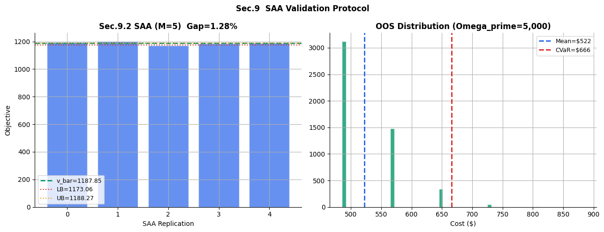

# reshoring-cvar
### CVaR-Based Stochastic Reshoring Optimizer with Cox-Process Scenario Generation

> *Quantifies when domestic sourcing pays off — mathematically, not as a gut feeling.*

[](https://colab.research.google.com/github/dismissed8582/reshoring-cvar/blob/main/notebooks/tailguard.ipynb)

---

## What is this?

A Jupyter notebook that answers one question every supply chain manager faced after COVID:

**"At what point does paying more for domestic suppliers actually make financial sense?"**

The tool calibrates a stochastic intensity model on real supply chain pressure data (GSCPI from the NY Fed), generates realistic disruption scenarios, and solves a mixed-integer optimization problem to find the sourcing mix that minimizes cost *and* tail risk simultaneously. No gut feeling, no politics — just math.

---

## Key Result



**Pay ~5% more on average. Save ~25% when supply chains crash.**

Calibrated on pre-COVID GSCPI data (2017–2019), the model already recommends domestic sourcing at λ=0.5 — a moderate risk aversion level that any conservative CFO would sign off on. The break-even shifts dramatically when post-2020 data is used, as shown below.

| Training period | Domestic sourcing recommended at |
|-----------------|----------------------------------|
| 2017–2019 (pre-shock) | λ ≥ 0.5 |
| 2020–2026 (post-shock) | λ ≥ 0.25 |

The implication: **a company that only looks at calm-period data will always underestimate tail risk and stay offshore too long.**

---

## How it works

### 1. Data

The model uses the [Global Supply Chain Pressure Index (GSCPI)](https://www.newyorkfed.org/research/policy/gscpi) published monthly by the NY Fed as the latent intensity signal. This index aggregates shipping costs, delivery delays, and manufacturing PMIs into a single number that spikes during disruptions.

### 2. CIR Intensity Calibration

The GSCPI series is mapped to a latent disruption intensity λ_t following a CIR (Cox-Ingersoll-Ross) diffusion:

```
dλ_t = a(b - λ_t)dt + η√λ_t dW_t
```

Parameters `a` (mean reversion), `b` (long-run level), `η` (volatility) are calibrated via OLS on the Euler-Maruyama discretization.

### 3. Cox Process Scenario Generation

A Cox (doubly stochastic Poisson) process generates shock counts N_T for each scenario:

```
N_T | Λ_T ~ Poisson(Λ_T),   Λ_T = ∫₀ᵀ λ_t dt
```

Because all routes share the same N_T, costs are **co-correlated** in the tail — when one supplier is hit, all offshore suppliers are hit. This is the key difference from naive independent Monte Carlo.

### 4. CVaR-MILP Optimization

The sourcing decision is formulated as a mixed-integer linear program using the Rockafellar-Uryasev CVaR linearization:

```
min  mean_cost(x) + λ · CVaR_α(Z(x))

s.t. one supplier per component
     x_i ∈ {0,1}
```

The output is a concrete list: *which component, from which supplier, at what cost.*

---

## Extensions implemented

All extensions from the companion paper are fully implemented:

| Section | Method | What it does |
|---------|--------|--------------|
| Sec.3 | CIR + Cox process | Realistic correlated shock scenarios |
| Sec.4 | Stratified sampling | 4–10x variance reduction vs crude Monte Carlo |
| Sec.5 | Benders decomposition | Scales to Ω=10⁵ scenarios; often finds better solutions than monolithic |
| Sec.6 | Spectral risk measures | Replaces single CVaR level with a weighted kernel over the full quantile range |
| Sec.7 | Wasserstein DRO | Robustness against calibration uncertainty in (a, b, η) |
| Sec.8 | Tail-dependence diagnostic | Proves Cox generator produces realistic co-shocks; independent generator does not |
| Sec.9 | SAA validation protocol | Mak-Morton-Wood confidence interval on optimality gap |

---

## Tail Dependence: Why it matters



This is the core mathematical argument. Under **independent** shock generation (standard Monte Carlo): zero joint tail events, λ_U = 0. The optimizer sees no reason to diversify.

Under **Cox** (shared intensity): λ_U = 1.0 — all routes crash together in the tail. The optimizer correctly identifies domestic sourcing as a hedge.

> *The risk measure didn't change. The scenarios did.*

---

## SAA Validation



Out-of-sample validation via the Mak-Morton-Wood protocol:
- Mean cost: **$522**
- CVaR₉₅: **$666**
- Optimality gap: **1.28%** (close to the 1% threshold; increase Ω for tighter bounds)

---

## Quickstart

### Run in Colab (no setup needed)

1. Click the Colab badge above
2. Runtime → Run all
3. Wait for all cells to execute (~2 minutes)
4. Use the control panel to set your training window and run extensions

### Run locally

```bash
git clone https://github.com/dismissed8582/reshoring-cvar
cd reshoring-cvar
pip install pulp ipywidgets requests openpyxl "xlrd>=2.0.1" scipy
jupyter notebook notebooks/tailguard.ipynb
```

---

## Bring your own data

### Upload a BOM CSV

The notebook has a built-in upload widget. Your CSV needs these columns:

| Column | Description | Example |
|--------|-------------|---------|
| `component` | Part group name | `Battery_Cell` |
| `supplier` | Supplier / route label | `CATL_CN_sea` |
| `base_cost` | Unit cost in normal times ($) | `85` |
| `kappa` | Extra cost per disruption event ($) | `62` |
| `lead_time` | Delivery time in days | `28` |
| `type` | `offshore` or `domestic` | `offshore` |

**Rule of thumb for kappa:** offshore suppliers typically have κ ≈ 0.3–1.5× base cost. Domestic suppliers κ ≈ 0.03–0.08× base cost. Calibrate from historical event studies if available.

### Generate synthetic example BOMs

```bash
python generate_bom.py --industry auto    # Automotive (Tesla/BMW style)
python generate_bom.py --industry chem    # Chemicals (BASF style)
python generate_bom.py --industry semi    # Semiconductor supply
python generate_bom.py --industry pharma  # Pharma API supply
python generate_bom.py --custom 10 3      # 10 components, 3 options each
python generate_bom.py --list             # show all options
```

Generated CSVs go to `data/bom/` and can be uploaded directly into the notebook.

---

## Repository structure

```
reshoring-cvar/
├── README.md
├── .gitignore
├── generate_bom.py              # Synthetic BOM generator
├── CVaR_Cox_Reshoring_Extended.pdf  # Companion paper
├── notebooks/
│   └── tailguard.ipynb
├── data/
│   └── bom/
│       ├── bom_auto.csv         # Automotive example
│       ├── bom_chem.csv         # Chemicals example
│       ├── bom_semi.csv         # Semiconductor example
│       ├── bom_pharma.csv       # Pharma example
│       └── bom_template.csv     # Blank template
└── results/
    ├── summary_gscpi_train_test.png
    ├── efficient_frontier_preshock.png
    ├── sec8_tail_dependence.png
    └── sec9_saa_validation.png
```

---

## Parameters explained

| Parameter | What it does | Default |
|-----------|-------------|---------|
| **CVaR α** | Confidence level — how extreme a scenario counts as "tail". 0.95 = worst 5%. | 0.95 |
| **λ (lambda)** | Risk aversion weight. 0 = minimize cost only. Higher = more tail protection, more domestic. | 1.0 |
| **Ω (Omega)** | Number of scenarios. More = more accurate but slower. | 1,000 |
| **Training window** | GSCPI period used to calibrate the CIR. Pre-shock vs post-shock gives very different results. | 2017–2019 |

---

## Based on

- Chandran & Shanmuganathan (2026) — BOM-DAG stochastic reshoring decision model
- Rockafellar & Uryasev (2000) — CVaR linearization via variational form
- Mohajerin Esfahani & Kuhn (2018) — Wasserstein distributionally robust optimization
- Mak, Morton & Wood (1999) — SAA confidence interval protocol
- Cox (1955) — Doubly stochastic Poisson process

---

## Limitations

- The BOM and κ values in the default Tesla example are illustrative, not from public filings
- Single-factor CIR model — a multi-factor extension (geopolitical + climatic + macro) is straightforward
- DRO radius ε = c/√Ω is theory-driven; cross-validation for ε would improve robustness
- Optimality gap > 1% at Ω=1,000 — increase to Ω=5,000–10,000 for production use

---

## License

MIT
